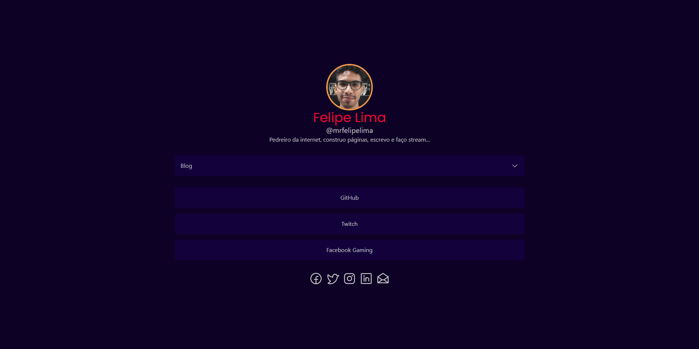

<div align="center" id="top"> 
  

  &#xa0;

  <a href="https://felpelima.net">Demo</a>
</div>

<h1 align="center">My Own Link List</h1>

<p align="center">
  

  

  

  

  <!--  -->

  <!--  -->

  <!--  -->
</p>

<!-- Status -->

<!-- <h4 align="center"> 
	🚧  Login Page 🚀 Under construction...  🚧
</h4>  -->

<hr>

<p align="center">
  <a href="#dart-about">About</a> &#xa0; | &#xa0; 
  <a href="#sparkles-features">Features</a> &#xa0; | &#xa0;
  <a href="#rocket-technologies">Technologies</a> &#xa0; | &#xa0;
  <a href="#white_check_mark-requirements">Requirements</a> &#xa0; | &#xa0;
  <a href="#checkered_flag-starting">Starting</a> &#xa0; | &#xa0;
  <a href="#memo-license">License</a> &#xa0; | &#xa0;
  <a href="https://github.com/mrfelipelima" target="_blank">Author</a>
</p>

<br>

## :dart: About ##

I create this project in a alternative to linktr.ee platform. With my own link list, i can do any personalization that i want, track my visitors ans improve the SEO for the page.

## :sparkles: Hey! ##

This repository has a [special post on my blog](https://mrfelipelima.wordpress.com/2023/01/24/fiz-meu-proprio-linktr-ee/), where a write how was the process for creation for this app.

## :rocket: Technologies ##

The following tools were used in this project:

- [React/NextJS](https://vitejs.dev/)
- [Tailwind CSS](https://tailwindcss.com/)
- [Headless UI](https://headlessui.dev/)
- [TypeScript](https://www.typescriptlang.org/)
- [Conventional Commits](https://www.conventionalcommits.org/en/v1.0.0/)
- [Vercel Deploy](https://vercel.com/)

<!-- ## :white_check_mark: Requirements ##

Before starting :checkered_flag:, you need to have [Git](https://git-scm.com), [Node](https://nodejs.org/en/) and [Yarn](https://yarnpkg.com/) installed.

## :checkered_flag: Starting ##

```bash
# Clone this project
$ git clone https://github.com/mrfelipelima/mrfelipelima-links

# Access
$ cd login-page

# Install dependencies
$ yarn

# You need to rename the '.env.example' file to '.env' and insert your firebase credentials before run

# Run the project
$ yarn dev

# The server will initialize in the <http://localhost:3000>
``` -->

## :memo: License ##

This project is under license from MIT. For more details, see the [LICENSE](LICENSE.md) file.


Made with :heart: by <a href="https://github.com/mrfelipelima" target="_blank">Felipe Lima</a>

&#xa0;

<a href="#top">Back to top</a>
